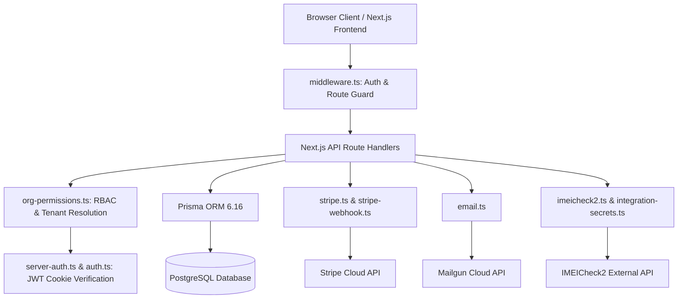

# iCellShop POS — Architecture Audit & Technical System Map
**PitayaCode Engineering & Product Protocol**
**Document Version:** 1.0.0
**Date:** September 2026

---

## 1. Executive & Architecture Overview

iCellShop POS is a multi-tenant Wholesale & Retail POS / Inventory Management Platform designed specifically for Apple device distributors, wholesalers, and repair shops. Originally prototyped through vibe coding, the system has evolved into a feature-rich Next.js application with robust database models, Stripe billing, multi-seat team management, and repair ticketing.

### Technology Stack Summary
* **Frontend Framework:** Next.js 16.1.6 (App Router)
* **UI Library:** React 19.2.3
* **Language:** TypeScript 5.x
* **Styling Engine:** Tailwind CSS 4.1.14 with PostCSS
* **Backend Runtime:** Node.js (LTS), Next.js Route Handlers (Edge / Serverless compatible handlers)
* **Database:** PostgreSQL
* **ORM:** Prisma 6.16.0 (39 applied migrations)
* **Authentication:** Stateless JWT Sessions (`jose`) stored in HttpOnly, SameSite=Lax cookies (`icellshop_session`)
* **Authorization:** Role-Based Access Control (`superadmin`, `admin`, `staff`) with custom granular permissions (`permissionsJson`)
* **Billing & Payments:** Stripe API & Stripe Webhooks (Plans: Free Trial, Basic, Pro, extra seats)
* **Email Service:** Mailgun API / SMTP integration for verification codes, sale receipts, dead-stock reminders, and invites
* **Document Generation:** `pdf-lib` for vector-accurate 80mm/Letter thermal receipts, `sharp` for logo processing
* **Barcode / QR Engines:** `@zxing/browser` (camera scanning), `jsbarcode` (Code128 generation), `react-qr-code` (dynamic QR)
* **Hosting Targets:** Railway / Render / Docker-compatible Node runtime

---

## 2. Module Map (Real Codebase Inventory)

Based on the actual routes and server-side components in `src/app` and `src/lib`:

```text
├── Authentication & Session Management
│   ├── Login, Logout, Multi-Org Switcher (/api/auth/login, switch-org)
│   ├── Self-Registration & Org Provisioning (/api/auth/register)
│   ├── Superadmin Email 2FA Verification (/api/auth/login with 6-digit code)
│   ├── Password Reset Workflow (/api/auth/request-password-reset, reset-password)
│   └── Profile & Language Preferences (/api/auth/user-profile, language)
│
├── Multi-Tenancy & Team Management
│   ├── Organizations & Memberships (/api/org/team, /api/org/invites)
│   ├── Seat Allocation & Licensing Engine (/lib/org-seats.ts)
│   └── Granular Permissions System (/lib/org-permissions.ts)
│
├── Inventory & Hardware Control
│   ├── Device Catalog & IMEI Tracking (/api/inventory, /app/inventory)
│   ├── Device Guide & Pricing Matrix (/api/pricing-rules, /app/device-guide)
│   ├── Device Intake & Quick Add (/app/add-device)
│   ├── Multi-Location / Multi-Site Storage (/api/locations)
│   ├── CSV Bulk Import & Export (/api/inventory/export, /app/inventory)
│   ├── Label Designer & Thermal Printing 2.4x2.1" (/app/label-designer, /lib/label-template.ts)
│   └── DIO Dead Stock Automated Reminders (/api/cron/dio-reminders, /api/org/dio-reminders)
│
├── Point of Sale & Checkout (POS)
│   ├── Real-time Cart & Fast Scanner (/app/sales)
│   ├── Multi-Tier Pricing (Price, Price 2, Price 3)
│   ├── Split Payments (Cash, Transfer, Card, Trade-in, Credit, Other)
│   ├── Instant PDF Receipt Generation & Thermal Printing (/lib/sale-receipt-pdf.ts)
│   ├── WhatsApp Receipt Sharing (/lib/receipt-share.ts)
│   └── Sale Cancellation & Return Processing (/api/cancel-sale)
│
├── Wholesale B2B & Public Ordering
│   ├── Public Organization Storefront (/[slug])
│   ├── Public Stock Filtering & Customer Quote Requests (/api/public-purchase-request)
│   ├── Inbound Customer Purchase Orders Management (/app/purchase-orders, /api/purchase-orders)
│   └── Inter-Organization Inventory Transfer System (/api/inventory-requests, /app/inventory-requests)
│
├── Credit & Debt Ledger
│   ├── Customer Receivables Ledger (/app/credit, /api/credit-ledger)
│   ├── Partial Payments & Debt Settlement
│   └── Inter-Org Payables Reconciliation (/api/credit-ledger/payables)
│
├── Cash Drawer & Operations Audit
│   ├── Shift Cash/Transfer Drawer Reconciliation (/app/audit, /api/audit)
│   └── Comprehensive System Audit Log (/lib/audit-log.ts, /app/admin/logs)
│
├── Repair Service Management
│   ├── Repair Intake & Ticket Lifecycle (/app/repairs, /api/repairs)
│   ├── Diagnostic Checklists & Typical Failures Catalog (/api/repair-typical-failures)
│   ├── Parts Supplier & Parts Usage Costing (/api/parts-suppliers, /api/repairs/[id])
│   └── Repair POS Conversion & Checkout (/api/repairs/[id]/checkout)
│
├── External Device Diagnostics (IMEICheck2)
│   ├── Encrypted API Key Storage (/lib/integration-secrets.ts)
│   ├── Balance & Catalog Synchronization (/lib/imeicheck2.ts)
│   └── Bulk IMEI Carrier/iCloud/FMI Query History (/app/imeicheck2)
│
├── SaaS Billing & Stripe Engine
│   ├── Stripe Checkout Sessions (/api/billing/create-stripe-session)
│   ├── Webhook Ingestion & Status Lifecycle (/lib/stripe-webhook.ts)
│   └── Subscription Plan Enforcement & Seat Limits (/lib/subscription.ts)
│
└── Platform Administration (Superadmin)
    ├── Tenant Health & Metrics Dashboard (/app/admin)
    ├── Organization Impersonation & Provisioning (/app/admin/organizations)
    └── Global Brand Assets Management (/api/admin/app-brand-logo)
```

---

## 3. Dependency Map



---

## 4. End-to-End Data Flow

### 4.1 Authenticated POS Sale Flow
```text
Cashier (UI /sales)
  │
  ├─ 1. Scan / Input IMEI or Serial
  │      ▼
  ├─ 2. Fetch /api/inventory?status=Available (Client filtered by active Org)
  │      ▼
  ├─ 3. Select Customer & Tier (Price, Price 2, Price 3)
  │      ▼
  ├─ 4. Configure Payment Breakdown (Cash, Transfer, Credit, Trade-in)
  │      ▼
  ├─ 5. POST /api/sales
         │
         ├── middleware.ts verifies JWT Cookie ('icellshop_session')
         ├── getRequestOrgAccess(req) verifies User Membership in Active Org
         ├── isSubscriptionActive(sub) verifies Organization is Active or Trialing
         ├── db.$transaction()
         │    ├── Validate customer credit (if Credit payment used)
         │    ├── INSERT INTO "Sale"
         │    ├── INSERT INTO "SaleItem" (storing frozen salePrice & cost)
         │    ├── UPDATE "InventoryItem" SET status = 'Sold'
         │    ├── INSERT INTO "CreditLedger" (if credit debt incurred)
         │    └── INSERT INTO "InventoryTransferRequest" (if customer is another Org user)
         ├── db.auditLog.create()
         ├── buildSaleReceiptPdf() (Vector thermal PDF)
         └── sendSaleReceiptEmail() via Mailgun
```

### 4.2 Public Inventory & Customer Order Flow
```text
Wholesale Buyer (Public Browser /[slug])
  │
  ├─ 1. GET /api/public-inventory-by-slug/[slug]
  │      ├── Loads Org by slug
  │      ├── Verifies Org subscription is Active/Trialing and publicInventoryEnabled == true
  │      └── Returns public items & configurable columns
  │
  ├─ 2. Buyer selects items and submits Purchase Request
  │      ▼
  └─ 3. POST /api/public-purchase-request/[slug]
         ├── INSERT INTO "PurchaseRequest" (payload contains requested IMEIs & offer)
         └── Email notification sent to Org Admins
```

---

## 5. Critical Technical Findings & Architecture Risks

1. **Missing Scripts Block in `package.json`**:
   `package.json` has zero `"scripts"` defined. Commands like `npm run build`, `npm run start`, and `npm run dev` rely on external presets or fail directly in clean container setups.
2. **Deploy Blocking Health Check**:
   `/api/system-health` strictly requires a `superadmin` authenticated session. Container orchestrators (Railway, Render) cannot authenticate and will fail deployment health probes.
3. **Dual Stripe Webhook Routes**:
   Two routes exist: `/api/billing/webhook` and `/api/billing/stripe-webhook`. While both point to the handler, having two entry points risks split configurations.
4. **LocalStorage Leaks vs Database Persistence**:
   While the `Organization` database table includes `logoData`, `receiptConfigJson`, `gradeOptionsJson`, and `conditionOptionsJson`, legacy methods in `src/lib/sheets.ts` still read and write to `localStorage` for certain settings, isolating changes to a single browser.
5. **Git Repository Uninitialized**:
   The workspace directory is currently not initialized as a git repository (`fatal: not a git repository`).
