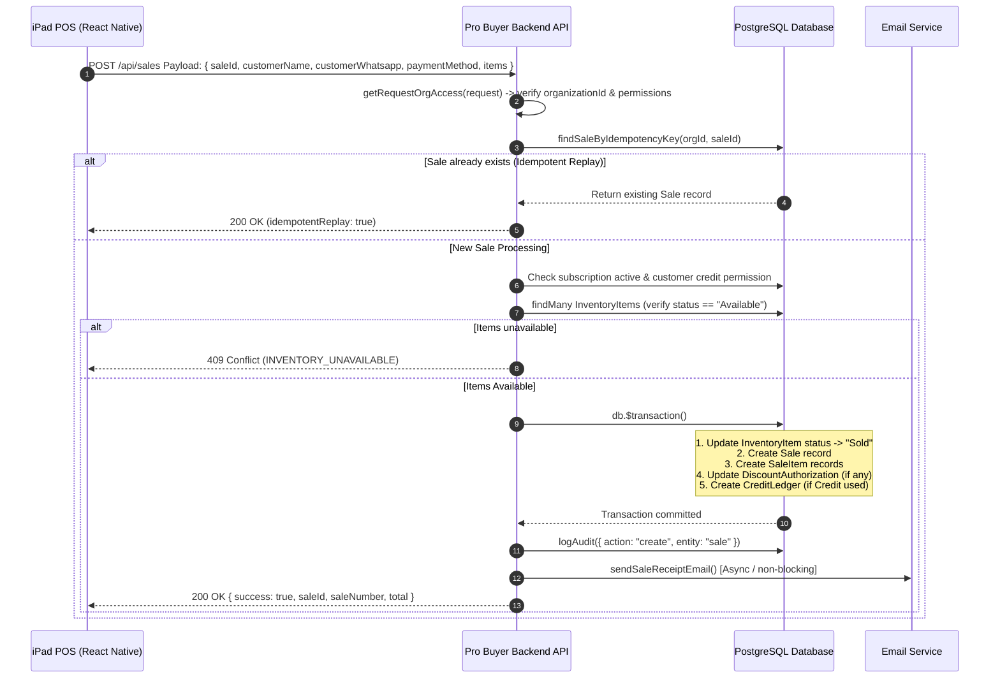
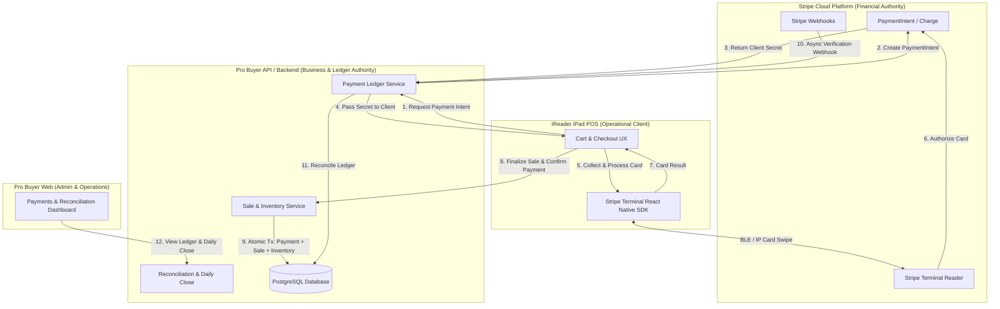
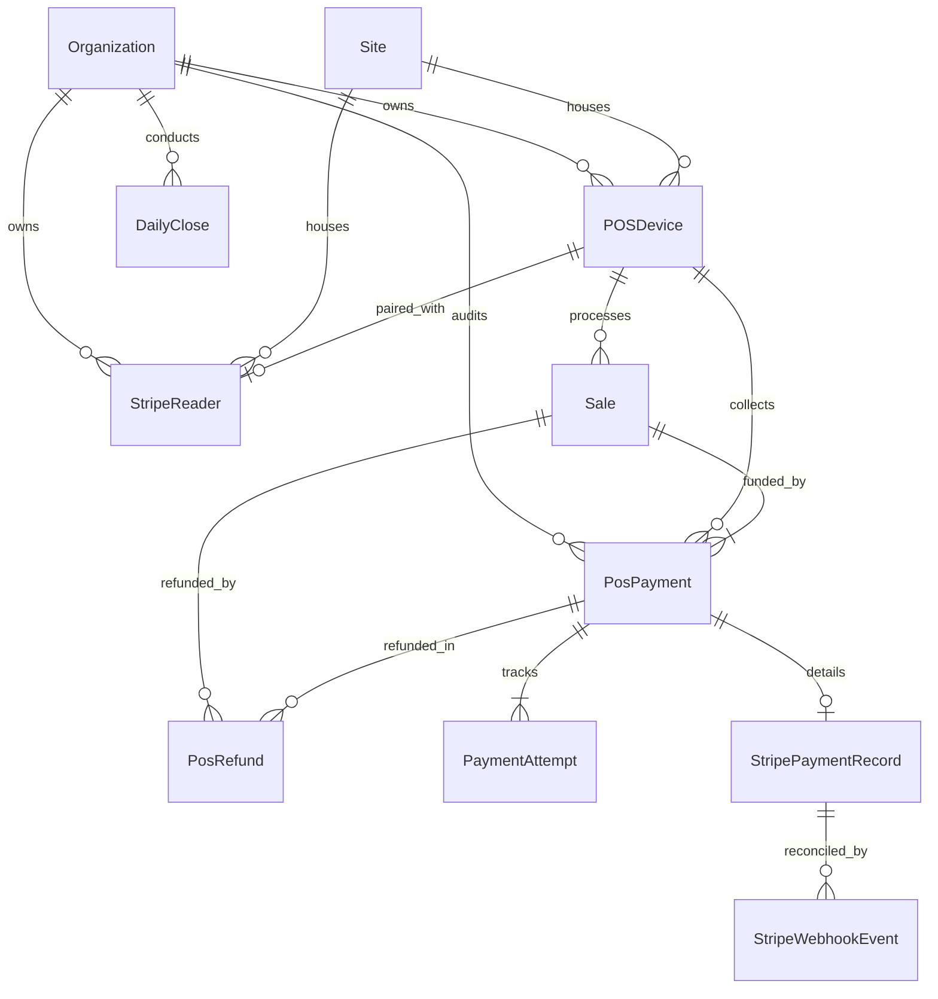
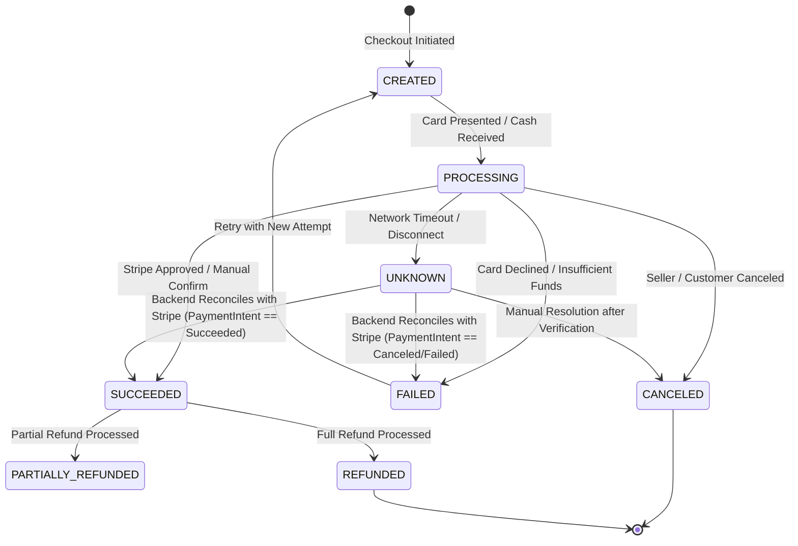
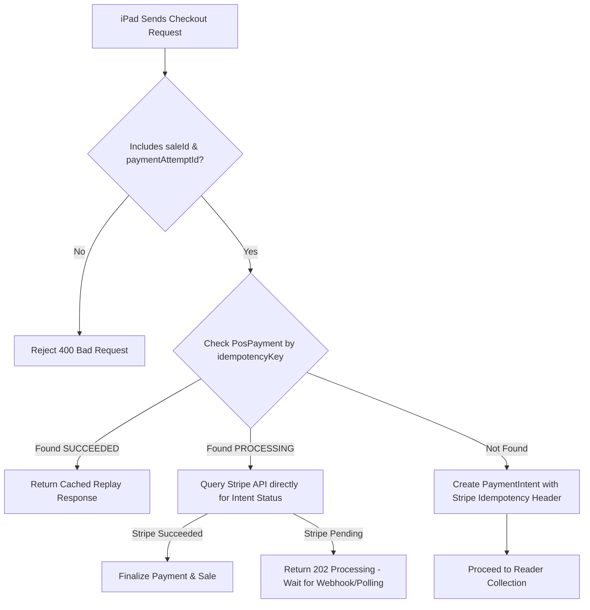
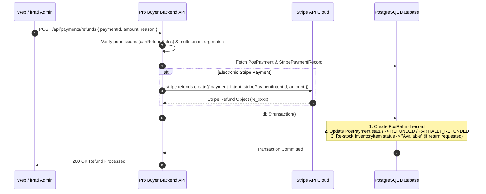
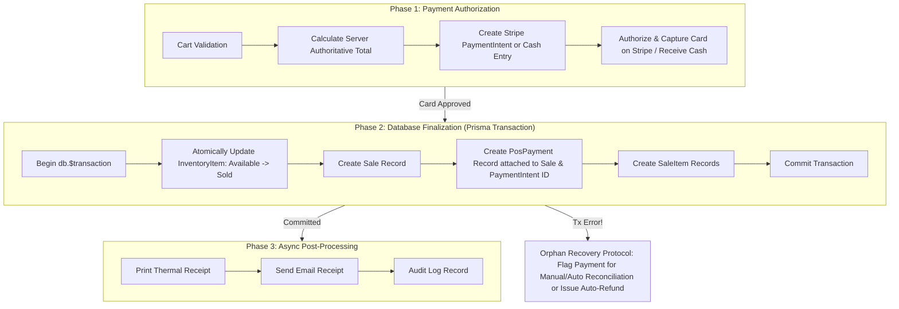
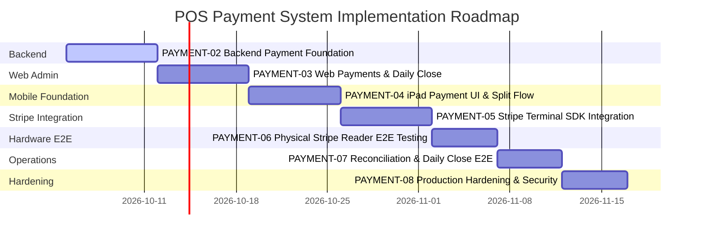

# PAYMENT-01: Payment System Architecture & Data Model Audit

> **Document Version:** 1.0.0  
> **Status:** AUDIT & SPECIFICATION COMPLETE  
> **Target Subsystem:** Pro Buyer Web / Pro Buyer API / iReader iPad POS / Stripe Terminal  
> **Author:** Principal POS Architect  
> **Date:** October 2, 2026  

---

## 1. Executive Summary

This document presents the definitive architectural audit and domain specification for the new POS Payment System across the **iReader / Pro Buyer** ecosystem. The audit strictly evaluates the current repository state across the iPad POS application (`@ireader/mobile`), the Web administration platform (Next.js App Router), the core backend API, and the PostgreSQL/Prisma data layer.

### Key Audit Findings & Architectural Decisions
1. **Existing Payment State:** The current repository records payments as a flat `paymentMethod` string column on the `Sale` table (e.g. `"Cash"`, `"Card"`, `"Transfer"`, `"Credit"`, `"Other"`). A `Payment` table exists in Prisma (`prisma/schema.prisma`), but it is exclusively coupled to `Organization` and `User` for **SaaS platform subscription billing** and is completely unlinked to store `Sale` transactions.
2. **Hardware & Tap to Pay Compatibility:** Official Stripe documentation and hardware specs establish that **Tap to Pay on iPhone** is hardware-restricted by Apple to iPhone XS or newer (iOS 16.7+ / 17.0+). **iPads lack the required NFC hardware architecture and Secure Element certification for Tap to Pay**. Therefore, Tap to Pay on iPad is marked as **INCOMPATIBLE / NOT SUPPORTED BY APPLE & STRIPE**. Physical Bluetooth/IP Stripe Readers (e.g., Stripe Reader M2, B2B5, WisePad 3, Stripe Reader S700) serve as the **mandatory hardware path** for the iPad POS application.
3. **Authority Boundaries:** The iPad POS application is an **operational client**, NOT a financial authority. The Pro Buyer Backend is the sole authority for final Sale pricing, inventory decrements, customer credit enforcement, and ledger persistence. Stripe is the sole authority for card-present electronic authorization and capture.
4. **Transaction Boundary & Split Payments:** To support split payments (e.g., $15,000 MXN via Stripe Card + $5,000 MXN via Cash on a $20,000 MXN Sale) and ensure safe failure recovery, the data model must transition from `1 Sale : 1 paymentMethod` string to `1 Sale : N Payments`, with an explicit `PaymentAttempt` state machine tracking raw card-present interactions before sale finalization.

---

## 2. Current Architecture (Discovered State)

The repository was systematically audited across all 15 discovery dimensions (A through O):

| Component / Dimension | Current Implementation in Repository | Verification Location |
| :--- | :--- | :--- |
| **A. iPad Application** | React Native + Expo app (`@ireader/mobile`), consuming `@ireader/application` and `@ireader/contracts`. Uses `CheckoutSheet.tsx` for POS checkout. | [`apps/mobile/package.json`](file:///c:/PitayaCode/icellshoppos/apps/mobile/package.json), [`apps/mobile/src/components/checkout/CheckoutSheet.tsx`](file:///c:/PitayaCode/icellshoppos/apps/mobile/src/components/checkout/CheckoutSheet.tsx) |
| **B. Web Application** | Next.js 16 (App Router) server & client components in `src/app`. Features inventory management, sales history, customer credit, and audit logs. | [`src/app`](file:///c:/PitayaCode/icellshoppos/src/app) |
| **C. Backend / API** | Next.js API Routes in `src/app/api/sales/route.ts`. Executes Prisma interactive transactions with session-based organization isolation. | [`src/app/api/sales/route.ts`](file:///c:/PitayaCode/icellshoppos/src/app/api/sales/route.ts) |
| **D. Prisma / Database** | PostgreSQL via Prisma 6 (`@prisma/client`). Schema contains `Organization`, `User`, `Customer`, `Sale`, `SaleItem`, `InventoryItem`, `RegisterAudit`, `CreditLedger`, `DiscountAuthorization`. | [`prisma/schema.prisma`](file:///c:/PitayaCode/icellshoppos/prisma/schema.prisma) |
| **E. Existing Sale Model** | Single `Sale` table with `subtotal`, `discount`, `total`, `paymentMethod` (String?), `soldBy`, `notes`. | [`prisma/schema.prisma#L501-L525`](file:///c:/PitayaCode/icellshoppos/prisma/schema.prisma#L501-L525) |
| **F. Existing Checkout Flow** | Atomic interactive transaction (`db.$transaction`): 1. Updates `InventoryItem.status` from `"Available"` to `"Sold"`, 2. Creates `Sale`, 3. Creates `SaleItem` records, 4. Updates `DiscountAuthorization`, 5. Creates `CreditLedger` (if credit used), 6. Generates receipt PDF & email asynchronously. | [`src/app/api/sales/route.ts#L445-L648`](file:///c:/PitayaCode/icellshoppos/src/app/api/sales/route.ts#L445-L648) |
| **G. Customer Flow** | `Customer` model linked to `Organization`. Auto-upserted by name/whatsapp/email during checkout. Enforces `creditEnabled` boolean for credit payments. | [`prisma/schema.prisma#L321-L340`](file:///c:/PitayaCode/icellshoppos/prisma/schema.prisma#L321-L340) |
| **H. Inventory Flow** | `InventoryItem` with unique IMEI or SKU per organization. Status transitions: `Available` -> `Sold`. Supports cost tracking in USD/MXN. | [`prisma/schema.prisma#L454-L500`](file:///c:/PitayaCode/icellshoppos/prisma/schema.prisma#L454-L500) |
| **I. Auth / Org Context** | Session-based JWT authentication (`getRequestOrgAccess(request)`). All database queries strictly filter by `organizationId`. | [`src/lib/org-permissions.ts`](file:///c:/PitayaCode/icellshoppos/src/lib/org-permissions.ts) |
| **J. Idempotency** | Server-side lookup via `findSaleByIdempotencyKey(organizationId, saleNumber)`. Returns cached replay response if sale exists. Unique index on `@@unique([organizationId, saleNumber])`. | [`src/lib/sales-idempotency.ts`](file:///c:/PitayaCode/icellshoppos/src/lib/sales-idempotency.ts) |
| **K. Audit Mechanisms** | `AuditLog` table logged via `logAudit()`. `RegisterAudit` table records period cash & transfer audit counts. | [`src/lib/audit-log.ts`](file:///c:/PitayaCode/icellshoppos/src/lib/audit-log.ts) |
| **L. WhatsApp Auth Flow** | `DiscountAuthorization` model linked to draft sales (`IPAD-*` or UUID) for real-time manager approval before checkout. | [`prisma/schema.prisma#L790-L816`](file:///c:/PitayaCode/icellshoppos/prisma/schema.prisma#L790-L816) |
| **M. Device / POS Concepts** | `RegisterAudit` captures shift register closes per user/organization. Physical POS device registration entity is **NOT PRESENT**. | [`prisma/schema.prisma#L718-L740`](file:///c:/PitayaCode/icellshoppos/prisma/schema.prisma#L718-L740) |
| **N. Existing Stripe Code** | `stripe` instance initialized in `src/lib/stripe.ts` using `stripe` v20.4.0. Used exclusively for SaaS subscription billing (`/api/billing/*`). Stripe Terminal SDK is **NOT PRESENT**. | [`src/lib/stripe.ts`](file:///c:/PitayaCode/icellshoppos/src/lib/stripe.ts) |
| **O. Payment-related Code** | `CheckoutPaymentEntry` interface in `@ireader/contracts` supports split payments in contract definitions, but backend API currently accepts only a flat string `paymentMethod` and optional `paymentBreakdown` JSON. | [`packages/contracts/src/checkout.ts#L12-L16`](file:///c:/PitayaCode/icellshoppos/packages/contracts/src/checkout.ts#L12-L16) |

---

## 3. Existing Checkout Flow



---

## 4. Existing Sale / Data Model Analysis

### Current Database Tables
1. **`Sale`**:
   - `id`: String (UUID PK)
   - `organizationId`: String (FK to `Organization`)
   - `customerId`: String? (FK to `Customer`)
   - `saleNumber`: String (e.g., `S-1740000000000` or `IPAD-xxx`)
   - `subtotal`: Decimal(12,2)
   - `discount`: Decimal(12,2)
   - `total`: Decimal(12,2)
   - `paymentMethod`: String? (Flat string: `"Cash"`, `"Card"`, `"Transfer"`, `"Credit"`, `"Other"`)
   - `notes`: String?
   - `soldBy`: String?
   - `createdAt`: DateTime
   - `updatedAt`: DateTime
   - *Index:* `@@unique([organizationId, saleNumber])`

2. **`Payment` (SaaS Subscription Only - Needs Renaming / Refactoring in PAYMENT-02)**:
   - `id`: String (UUID PK)
   - `organizationId`: String
   - `userId`: String
   - `stripePaymentId`: String?
   - `stripeSessionId`: String?
   - `amountCents`: Int
   - `currency`: String
   - `status`: String
   - *Limitations:* Cannot record store POS payments; lacks `saleId`, payment method types, reader identifiers, and attempt history.

3. **`RegisterAudit`**:
   - Captures shift/period totals (`expectedCashAmount`, `countedCashAmount`, `expectedTransferAmount`, `countedTransferAmount`).
   - *Limitations:* Lacks card-present Stripe totals and POS device metadata.

---

## 5. Existing Payment Capabilities

- **Cash Payments:** Fully operational (manual entry, recorded on `Sale.paymentMethod = "Cash"`).
- **SPEI / Bank Transfers:** Operational (manual entry, recorded on `Sale.paymentMethod = "Transfer"`).
- **Store Credit:** Operational (validates `Customer.creditEnabled`, creates a `CreditLedger` entry with `type = "sale_on_credit"`).
- **Card Payments:** **Manual / Unintegrated Only**. The seller selects `"Card"` in `CheckoutSheet.tsx`, processes the card on a standalone external terminal, and manually types auth reference notes.
- **Integrated Card-Present Payments:** **NOT PRESENT**.

---

## 6. Stripe Capability & Hardware Research

### Official Stripe Documentation Audit

| Requirement | Official Stripe Specification | System Status / Verdict |
| :--- | :--- | :--- |
| **SDK Compatibility** | `@stripe/stripe-terminal-react-native` provides official bindings for React Native on iOS. | **COMPATIBLE** |
| **Tap to Pay on iPhone** | Supported on iPhone XS or newer running iOS 16.7+ / 17.0+. | **SUPPORTED ON IPHONE ONLY** |
| **Tap to Pay on iPad / iPadOS** | **Not supported by Apple or Stripe**. iPads do not possess the required NFC architecture or hardware Secure Element certification for Tap to Pay card-present authorization. | **INCOMPATIBLE HARDWARE (OPEN COMPATIBILITY RESOLVED: NOT SUPPORTED)** |
| **Physical Stripe Readers** | Supported readers: Stripe Reader M2, WisePad 3, Stripe Reader S700, Verifone P400 (IP). Connect via Bluetooth Low Energy (BLE) or Local IP Network (Wi-Fi/Ethernet). | **PRIMARY HARDWARE PATH** |
| **Authentication Model** | Mobile app requests a short-lived **Connection Token** from the backend (`stripe.terminal.connectionTokens.create()`). The secret key `sk_live_*` remains strictly on the server. | **COMPATIBLE / SECURE** |
| **Payment Lifecycle** | 1. Backend creates `PaymentIntent` (`payment_method_types: ['card_present']`), 2. App calls `collectPaymentMethod`, 3. App calls `processPayment`, 4. Server verifies & captures or relies on automatic capture. | **COMPATIBLE** |
| **Idempotency** | Stripe API accepts `idempotency_key` header on PaymentIntent creation to prevent duplicate charges. | **COMPATIBLE** |

> [!IMPORTANT]
> **Primary Hardware Path Mandate:** Because Tap to Pay is hardware-incompatible with iPad devices, all card-present transactions on iPad POS **MUST use physical Stripe Terminal readers** (Bluetooth BLE or Local Network IP).

---

## 7. Payment Domain Architecture

### Authority Boundaries & System Responsibilities



---

## 8. Proposed Data Model (Target Architecture)



### Proposed Entity Definitions

#### 1. `POSDevice` (New)
- **Purpose:** Registers physical iPad units operating as POS terminals.
- **Fields:** `id` (UUID PK), `organizationId` (FK), `siteId` (FK), `deviceName` (String), `deviceUuid` (String, Unique per org), `appVersion` (String), `status` (`ACTIVE`, `INACTIVE`), `lastSeenAt` (DateTime).
- **Tenant Boundary:** Enforced by `organizationId`.

#### 2. `StripeReader` (New)
- **Purpose:** Tracks physical Stripe Terminal readers registered to a store/location.
- **Fields:** `id` (UUID PK), `organizationId` (FK), `siteId` (FK), `stripeReaderId` (String, Unique on Stripe), `label` (String), `serialNumber` (String), `deviceType` (String, e.g. `"STRIPE_M2"`), `connectionType` (`BLUETOOTH`, `IP`), `ipAddress` (String?), `locationId` (String), `status` (`ONLINE`, `OFFLINE`, `UNPAIRED`), `pairedPosDeviceId` (FK to `POSDevice`?).

#### 3. `PosPayment` (New Store Payment Entity)
- **Purpose:** Authoritative financial ledger record for payments applied to store Sales.
- **Fields:**
  - `id`: UUID PK
  - `organizationId`: FK to `Organization`
  - `saleId`: FK to `Sale`
  - `posDeviceId`: FK to `POSDevice`?
  - `paymentMethod`: Enum (`CASH`, `TRANSFER`, `CARD_STRIPE`, `STORE_CREDIT`, `OTHER`)
  - `provider`: Enum (`STRIPE`, `MANUAL_CASH`, `MANUAL_BANK_TRANSFER`, `INTERNAL_CREDIT`)
  - `amount`: Decimal(12,2)
  - `currency`: String (Default: `"MXN"`)
  - `status`: Enum (`CREATED`, `PROCESSING`, `SUCCEEDED`, `FAILED`, `CANCELED`, `REFUNDED`, `PARTIALLY_REFUNDED`, `UNKNOWN`)
  - `idempotencyKey`: String (Unique per org)
  - `notes`: String?
  - `createdByUserId`: FK to `User`
  - `createdAt`, `updatedAt`: DateTime

#### 4. `PaymentAttempt` (New)
- **Purpose:** Audit log of each card swipe, tap, or manual retry attempt for a `PosPayment`.
- **Fields:** `id` (UUID PK), `paymentId` (FK), `attemptNumber` (Int), `provider` (String), `status` (String), `stripePaymentIntentId` (String?), `failureCode` (String?), `failureMessage` (String?), `rawResponseJson` (Json), `createdAt` (DateTime).

#### 5. `StripePaymentRecord` (New)
- **Purpose:** Encapsulates Stripe-specific card-present transaction metadata.
- **Fields:** `id` (UUID PK), `paymentId` (FK, Unique), `paymentAttemptId` (FK), `stripePaymentIntentId` (String, Unique), `stripeChargeId` (String?), `stripeReaderId` (String?), `stripeLocationId` (String?), `cardBrand` (String?), `cardLast4` (String?), `cardEntryMethod` (String, e.g., `"contactless"`, `"chip"`), `receiptUrl` (String?), `createdAt` (DateTime).

#### 6. `PosRefund` (New)
- **Purpose:** Authoritative record of partial or full refunds.
- **Fields:** `id` (UUID PK), `organizationId` (FK), `saleId` (FK), `paymentId` (FK), `amount` (Decimal(12,2)), `reason` (String), `status` (`PENDING`, `COMPLETED`, `FAILED`), `stripeRefundId` (String?), `requestedByUserId` (FK), `authorizedByUserId` (FK?), `createdAt` (DateTime).

#### 7. `StripeWebhookEvent` (New)
- **Purpose:** Guarantees idempotent, audited processing of Stripe webhooks.
- **Fields:** `id` (UUID PK), `stripeEventId` (String, Unique), `eventType` (String), `processed` (Boolean), `processedAt` (DateTime?), `payloadJson` (Json), `error` (String?).

#### 8. `DailyClose` (Enhanced Cash & Terminal Close)
- **Purpose:** Daily reconciliation of sales vs payments across all payment channels.
- **Fields:** `id` (UUID PK), `organizationId` (FK), `posDeviceId` (FK?), `openedAt` (DateTime), `closedAt` (DateTime), `expectedCash` (Decimal), `countedCash` (Decimal), `cashDiff` (Decimal), `expectedTransfer` (Decimal), `countedTransfer` (Decimal), `transferDiff` (Decimal), `expectedStripe` (Decimal), `countedStripe` (Decimal), `stripeDiff` (Decimal), `status` (`BALANCED`, `DISCREPANCY`), `closedByUserId` (FK), `notes` (String?).

---

## 9. Payment State Machine



### Disconnect Recovery Protocol (Network Disconnect Recovery)
If the iPad disconnects during card processing:
1. The iPad app MUST NOT allow a retry until payment status is resolved.
2. Upon reconnecting, the iPad calls `POST /api/payments/stripe/verify-status` with `paymentAttemptId` or `stripePaymentIntentId`.
3. The Pro Buyer Backend queries the Stripe API directly (`stripe.paymentIntents.retrieve(...)`).
4. If Stripe reports `status === 'succeeded'`, the backend completes the `PosPayment` and `Sale` records.
5. If Stripe reports `status === 'requires_payment_method'`, the backend safely marks the attempt as `FAILED` and permits a retry.

---

## 10. Idempotency Strategy



---

## 11. Stripe Terminal Architecture

```mermaid
sequenceDiagram
    autonumber
    participant iPad as iPad POS
    participant SDK as Terminal React Native SDK
    participant API as Pro Buyer Backend API
    participant Stripe as Stripe API Cloud
    participant Reader as Physical Reader (M2 / S700)

    iPad->>API: POST /api/payments/stripe/connection-token
    API->>Stripe: stripe.terminal.connectionTokens.create()
    Stripe-->>API: secret connection_token
    API-->>iPad: connection_token
    iPad->>SDK: initialize({ fetchConnectionToken })

    iPad->>API: POST /api/payments/stripe/create-intent { amount, currency, saleId }
    API->>Stripe: stripe.paymentIntents.create({ amount, currency, payment_method_types: ['card_present'] })
    Stripe-->>API: PaymentIntent object (client_secret)
    API-->>iPad: client_secret & paymentIntentId

    iPad->>SDK: connectReader(reader)
    SDK<-->>Reader: Connect BLE / IP
    iPad->>SDK: collectPaymentMethod({ clientSecret })
    Reader-->>SDK: Card Presented (Chip/Tap/Swipe)
    iPad->>SDK: processPayment(paymentIntent)
    SDK->>Stripe: Process Card Authorization
    Stripe-->>SDK: PaymentIntent Succeeded
    SDK-->>iPad: Success Result

    iPad->>API: POST /api/sales Payload + paymentIntentId
    API->>Stripe: stripe.paymentIntents.retrieve(paymentIntentId)
    Stripe-->>API: Status: succeeded
    API->>API: db.$transaction(Create Sale + Create PosPayment + Decrement Inventory)
    API-->>iPad: 200 Sale Completed
```

---

## 12. iPad Application Architecture

### Required Checkout UI States

```
[ Cart Screen ]
       │
       ▼
[ Select Payment Method ] ──► (Cash / Transfer / Store Credit / Stripe Card / Split)
       │
       ├─► [ Stripe Card Selected ]
       │          │
       │          ▼
       │   [ Reader Connection Status ]
       │          ├── Disconnected ──► [ Connect Reader Modal ]
       │          ├── Connecting... ──► [ Progress Indicator ]
       │          └── Connected ─────► [ Ready for Card ]
       │                                     │
       │                                     ▼
       │                            [ Prompt: Insert/Tap Card ]
       │                                     │
       │                                     ▼
       │                            [ Processing Payment... ]
       │                                     │
       │             ┌───────────────────────┴───────────────────────┐
       │             ▼                                               ▼
       │   [ Approved / Succeeded ]                         [ Declined / Failed ]
       │             │                                               │
       │             ▼                                               ▼
       │   [ Finalize Sale ]                                [ Display Error & Retry ]
       │             │
       │             ▼
       └───► [ Sale Complete & Print Thermal Receipt ]
```

---

## 13. Web Application Architecture

### Navigational Structure for Payments & Financial Ledger

```
/admin
  ├── /payments
  │     ├── /overview (Metrics: Today's Volume by Cash/Transfer/Stripe, Cash Register Status)
  │     ├── /transactions (Filterable Ledger: Sale #, Customer, Method, Amount, Status, POS Device)
  │     ├── /transactions/[id] (Deep Detail: Breakdown, Stripe PaymentIntent ID, Card Brand/Last4, Audit Log)
  │     └── /refunds (Pending/Approved Refunds, Refund Authorization Controls)
  ├── /daily-close
  │     ├── /current (Active Shift Counter & Expected vs Counted Cash/Transfer/Stripe)
  │     └── /history (Historical Reconciled Closes & Discrepancy Reports)
  └── /settings
        └── /stripe
              ├── /account (Stripe Connect / Account Configuration & Keys Status)
              ├── /locations (Stripe Terminal Location Sync)
              └── /readers (Registered Stripe Readers & Serial Numbers)
```

---

## 14. Backend Architecture

### Modular API Route Structure
```
src/app/api/
  ├── payments/
  │     ├── stripe/
  │     │     ├── connection-token/route.ts  (POST: Returns SDK Connection Token)
  │     │     ├── create-intent/route.ts     (POST: Creates Stripe PaymentIntent)
  │     │     ├── cancel-intent/route.ts     (POST: Cancels pending PaymentIntent)
  │     │     └── verify-status/route.ts     (POST: Resolves disconnect/unknown state)
  │     ├── refunds/route.ts                 (POST: Executes Partial/Full Refund)
  │     └── daily-close/route.ts             (POST: Closes shift & calculates diffs)
  ├── webhooks/
  │     └── stripe/route.ts                  (POST: Stripe Webhook Listener)
  └── sales/route.ts                         (POST: Finalizes Sale with attached payments)
```

---

## 15. Webhook Architecture

### Processing Protocol
1. **Endpoint:** `POST /api/webhooks/stripe`
2. **Signature Verification:** Verified using `stripe.webhooks.constructEvent(rawBody, signature, secret)`.
3. **Event Idempotency:** Checked against `StripeWebhookEvent` table (`stripeEventId`). If already processed, returns `200 OK` immediately.
4. **Handled Event Types:**
   - `payment_intent.succeeded`: Reconciles `PosPayment` status to `SUCCEEDED`. If Sale was pending, completes transaction.
   - `payment_intent.payment_failed`: Marks `PosPayment` and `PaymentAttempt` as `FAILED`.
   - `charge.refunded`: Updates `PosPayment` status to `REFUNDED` or `PARTIALLY_REFUNDED` and records `PosRefund`.

---

## 16. Refund Architecture



---

## 17. Daily Close Architecture

### Cash & Electronic Reconciliation Formula
$$\text{Total Expected} = \text{Cash Expected} + \text{Transfer Expected} + \text{Stripe Expected} + \text{Credit Expected}$$

$$\text{Cash Discrepancy} = \text{Cash Counted} - \text{Cash Expected}$$
$$\text{Transfer Discrepancy} = \text{Transfer Counted} - \text{Transfer Expected}$$
$$\text{Stripe Discrepancy} = \text{Stripe Counted} - \text{Stripe Expected}$$

> [!IMPORTANT]
> **Financial Distinction:**
> - **Stripe Payment Success (Gross Sales):** Real-time authorizations captured during checkout. Included in POS shift close.
> - **Stripe Payout / Settlement:** The net funds deposited into the merchant's bank account 1–2 business days later (Gross Sales minus Stripe Processing Fees). Payout settlement is handled in Web Bank Reconciliation, NOT on the shift cash register close.

---

## 18. Reconciliation Architecture

### End-to-End Traceability Spectrum

Every card-present transaction MUST maintain full chain-of-custody lineage:

$$\text{Organization} \longrightarrow \text{Site} \longrightarrow \text{POS Device (iPad)} \longrightarrow \text{Seller (User)} \longrightarrow \text{Sale} \longrightarrow \text{PosPayment} \longrightarrow \text{PaymentAttempt} \longrightarrow \text{Stripe PaymentIntent} \longrightarrow \text{Stripe Reader}$$

---

## 19. Security Model

1. **Credential Isolation:** `STRIPE_SECRET_KEY` and `STRIPE_WEBHOOK_SECRET` reside exclusively in server environment variables. Secrets are NEVER transmitted to or bundled inside the iPad POS application.
2. **Connection Tokens:** iPad POS authenticates with Stripe Terminal via short-lived Connection Tokens generated on-demand by the backend API.
3. **Multi-Tenancy:** All payment queries, intents, and webhook handlers validate tenant ownership via `organizationId`.
4. **RBAC Controls:**
   - Staff: Collect payments, process checkout, view personal sales.
   - Admin / Manager: Execute refunds, perform Daily Close, register/pair Stripe Readers, view store financial ledger.

---

## 20. Failure Scenarios & Mitigation Matrix

| Failure Scenario | Root Cause | System Impact | Automated Mitigation Strategy |
| :--- | :--- | :--- | :--- |
| **Card Declined** | Insufficient funds or bank flag | Terminal returns error | App displays user-friendly error; seller offers retry or alternative payment method without creating orphan sale. |
| **Network Loss during Card Swipe** | Wi-Fi drop on iPad | iPad UI hangs in `PROCESSING` | Disconnect Recovery Protocol: On reconnect, app queries backend `/api/payments/stripe/verify-status` to query Stripe API directly before retrying. |
| **Reader Disconnected** | BLE timeout or battery drain | Reader unpairs mid-checkout | App displays Reader Disconnected modal; pauses payment flow; auto-reconnects BLE without losing cart context. |
| **Stripe Webhook Delayed** | Stripe webhook queue lag | Web backend unaware of async update | iPad client calls backend verification endpoint directly; webhook acts as idempotent secondary safety reconciliation. |
| **Payment Captured but Database Down** | DB lock or network crash post-Stripe capture | Payment succeeded on Stripe, but Sale finalization failed | **Orphan Payment Protection:** Payment Intent ID is logged in `PaymentAttempt`. Backend auto-creates an unattached ledger entry (`PAYMENT_PENDING_SALE_FINALIZATION`) for manager reconciliation. |

---

## 21. Payment / Sale Transaction Boundaries



---

## 22. Open Questions

1. **Stripe Terminal Hardware Selection for Initial Rollout:** Which physical reader model will be used for primary physical testing? (Recommended: Stripe Reader M2 for Bluetooth portability, or Stripe Reader S700 for smart screen terminal).
2. **Stripe Account Setup:** Will each organization use Stripe Connect (Custom/Express accounts) or will Pro Buyer operate a single platform account with multi-tenant metadata tagging?

---

## 23. Risk Register

| ID | Risk Description | Severity | Mitigation Strategy |
| :--- | :--- | :--- | :--- |
| **R-01** | Physical Bluetooth reader disconnects during peak store hours. | **MEDIUM** | Implement robust auto-reconnect logic in Expo app and fallback to IP-based Wi-Fi readers (e.g. S700 / P400). |
| **R-02** | Orphan payment created due to unexpected backend crash between card capture and DB commit. | **HIGH** | Implement `PaymentAttempt` background sweeper job to detect unattached Stripe PaymentIntents and present them in Web Reconciliation UI. |
| **R-03** | Attempting to deploy Tap to Pay on iPad devices. | **HIGH (CRITICAL)** | Enforce strict architecture rule: Tap to Pay is disabled on iPad. Physical readers are mandatory. |

---

## 24. Recommended Implementation Phases



### Phase Summaries
- **PAYMENT-02: Backend Payment Foundation:** Introduce Prisma models (`POSDevice`, `StripeReader`, `PosPayment`, `PaymentAttempt`, `StripePaymentRecord`, `PosRefund`, `DailyClose`, `StripeWebhookEvent`). Implement core payment services and connection token endpoints.
- **PAYMENT-03: Web Payments & Daily Close:** Build Web admin dashboards for payment transactions, refund approvals, Stripe reader management, and shift daily close.
- **PAYMENT-04: iPad Payment Foundation:** Refactor `CheckoutSheet.tsx` to support split payments, multi-payment entries, and state machine UI transitions.
- **PAYMENT-05: Stripe Terminal Integration:** Integrate `@stripe/stripe-terminal-react-native` into `@ireader/mobile`, connecting connection tokens and intent lifecycle.
- **PAYMENT-06: Physical Stripe Reader E2E:** Conduct hardware testing with physical Stripe Readers (BLE/IP). Validate card presentation, pin debit, and error handling.
- **PAYMENT-07: Reconciliation & Daily Close E2E:** End-to-end validation of daily shift closes, cash vs card discrepancy reporting, and refund ledger integrity.
- **PAYMENT-08: Production Hardening:** Audit failure recovery under simulated network drops, benchmark database transaction speeds, and finalize security review.

---

## 25. Acceptance Criteria for PAYMENT-02

To mark **PAYMENT-02 (Backend Payment Foundation)** as ready for implementation, the following criteria must be satisfied:
1. Prisma schema updated with new domain entities (`POSDevice`, `StripeReader`, `PosPayment`, `PaymentAttempt`, `StripePaymentRecord`, `PosRefund`, `DailyClose`, `StripeWebhookEvent`) without altering existing `Sale` or SaaS `Payment` historical records.
2. Migration scripts generated and tested against PostgreSQL.
3. Backend API endpoint `POST /api/payments/stripe/connection-token` created and protected by session authentication.
4. Backend API endpoint `POST /api/payments/stripe/create-intent` implemented with organization multi-tenancy enforcement.
5. Unit tests validating payment state transitions and split payment calculations.

---

## Architecture Audit Verdict

```
==================================================
ARCHITECTURE STATUS:
READY WITH OBSERVATIONS

OBSERVATIONS:
1. Tap to Pay on iPad is hardware-incompatible (Apple/Stripe restriction). Physical Stripe Readers (BLE/IP) are mandatory for iPad POS.
2. Existing Prisma `Payment` table is used for SaaS subscriptions and must remain untouched; store POS payments will be introduced under `PosPayment`.
3. Disconnect recovery protocol must be implemented on the backend to query Stripe API status directly before permitting retries.

RECOMMENDED NEXT PHASE:
PAYMENT-02 (Backend Payment Foundation)
==================================================
```
