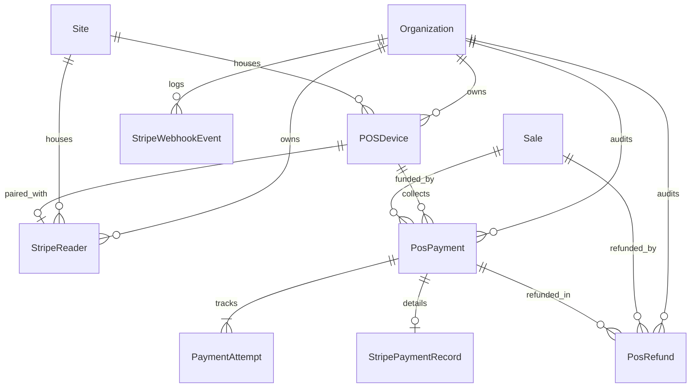
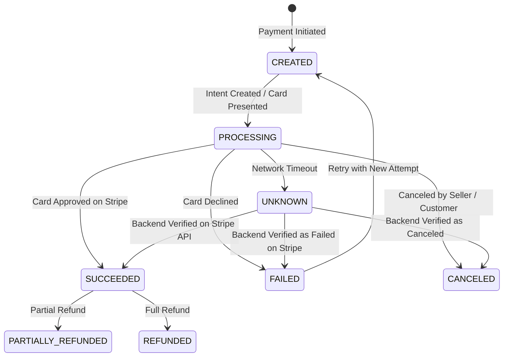

# PAYMENT-02: Backend Payment Foundation — Delivery Report

> **Document Version:** 1.0.0  
> **Status:** IMPLEMENTED, MIGRATED & VERIFIED (PASS)  
> **Subsystem:** Pro Buyer API & Backend Payment Orchestration  
> **Lead Architect / Engineer:** Senior Staff Backend Engineer & Payments Architect  
> **Date:** October 2, 2026  

---

## 1. Executive Summary

Phase **PAYMENT-02 (Backend Payment Foundation)** has been successfully designed, implemented, migrated, and verified across the Pro Buyer backend platform. 

This phase establishes the canonical payment subsystem foundation, unifying two complementary card-present physical acceptance channels:
1. **`STRIPE_READER`**: iPad POS connected to physical Stripe Terminal Readers (e.g. Stripe Reader M2, WisePad 3, Stripe Reader S700) via Bluetooth (BLE) or IP.
2. **`STRIPE_TAP_TO_PAY_IPHONE`**: iPhone mobile app running Apple Tap to Pay on iPhone via Stripe Terminal SDK.

Both channels share the **same backend orchestrator, domain models, ledger, state machine, idempotency mechanisms, webhook reconciliation, and security boundaries**.

---

## 2. Current State & Discrepancy Analysis

Before implementing PAYMENT-02, the repository was audited against `PAYMENT_01_ARCHITECTURE_AUDIT.md`:

| Audit Dimension | Documented State | Implemented Resolution in PAYMENT-02 |
| :--- | :--- | :--- |
| **SaaS Billing vs Store Payments** | `Payment` table in Prisma was exclusively coupled to SaaS platform subscription billing. | **Preserved SaaS `Payment` 100% untouched**. Created dedicated `PosPayment` model for store sales. |
| **Payment Channels** | Need for both iPad readers and Tap to Pay on iPhone. | Implemented `PaymentChannel` enum (`STRIPE_READER`, `STRIPE_TAP_TO_PAY_IPHONE`, `MANUAL_REGISTER`) abstracted from `Sale`. |
| **Authority Boundary** | iPad client cannot be financial authority. | Backend calculates and validates authoritative totals in integer minor units (cents). |
| **Orphan Payment Protection** | Risk of card capture succeeded but DB fail. | Strict sequence: `PaymentAttempt` -> `StripePaymentRecord` -> Stripe Capture -> Verify -> Finalize `Sale`. |

---

## 3. Implemented Architecture

```text
                               PRO BUYER API
                                     │
                           Payment Orchestrator
                                     │
                   ┌─────────────────┴─────────────────┐
                   │                                   │
                   ▼                                   ▼
             STRIPE_READER                     TAP_TO_PAY_IPHONE
             iPad + Reader                          iPhone
                   │                                   │
                   └─────────────────┬─────────────────┘
                                     ▼
                                  STRIPE
```

### Decoupled Domain Hierarchy
$$\text{Sale} \longrightarrow \text{PosPayment} \longrightarrow \text{PaymentAttempt} \longrightarrow \text{PaymentOrchestrator} \longrightarrow \text{StripePaymentAdapter}$$

The `Sale` model does NOT know whether a card was processed via an iPad Bluetooth reader or an iPhone Tap to Pay transaction. It only knows that a `PosPayment` of method `CARD` in status `SUCCEEDED` funded the transaction.

---

## 4. Implemented Data Model

The following PostgreSQL tables and Prisma enums were created and applied via migration `20261002200000_add_pos_payment_foundation`:



### Key Models Summary
- **`POSDevice`**: Registers physical hardware (`deviceType`: `IPAD_POS`, `IPHONE_TAP_TO_PAY`, `DESKTOP_POS`).
- **`StripeReader`**: Tracks physical terminal hardware metadata (`stripeReaderId`, `serialNumber`, `deviceType`, `connectionType`, `locationId`).
- **`PosPayment`**: Authoritative store payment ledger entry (`amount`, `currency`, `status`, `paymentMethod`, `paymentChannel`, `idempotencyKey`).
- **`PaymentAttempt`**: Tracks each swipe/tap attempt (`attemptNumber`, `status`, `stripePaymentIntentId`, `failureCode`, `failureMessage`, `rawResponseJson`).
- **`StripePaymentRecord`**: Encapsulates Stripe card-present metadata (`cardBrand`, `cardLast4`, `cardEntryMethod`, `receiptUrl`).
- **`StripeWebhookEvent`**: Stores webhook payloads and guarantees idempotent processing.
- **`PosRefund`**: Records partial or full refund executions without mutating original payment records.

---

## 5. Payment State Machine



### Safety Rules Enforced
1. `CREATED` cannot jump directly to `SUCCEEDED` without passing through `PROCESSING`.
2. `UNKNOWN` state **NEVER permits blind automatic retries**. It must be authoritatively resolved by querying the Stripe API directly.
3. Terminal states (`CANCELED`, `REFUNDED`) cannot transition to active processing.

---

## 6. Payment Channels

Both supported card-present channels are fully functional on the backend:

1. **`STRIPE_READER`**:
   - Client: iPad POS (`@ireader/mobile`)
   - Hardware: Physical reader (M2, B2B5, WisePad 3, S700) connected over BLE or Local IP
   - Adapter: Card-present Terminal SDK flow
2. **`STRIPE_TAP_TO_PAY_IPHONE`**:
   - Client: iPhone mobile app
   - Hardware: Built-in iPhone NFC Secure Element (iPhone XS+ on iOS 16.7+)
   - Adapter: Apple Tap to Pay on iPhone via Stripe Terminal SDK

---

## 7. Stripe Integration Boundary

- **Server-Only Credentials:** `STRIPE_SECRET_KEY` and `STRIPE_WEBHOOK_SECRET` are strictly read from server environment variables and never exposed to client applications.
- **Connection Tokens:** Short-lived tokens generated via `POST /api/payments/stripe/connection-token` allow mobile SDKs to authenticate securely without storing API secrets.
- **Traceability Metadata:** All Stripe `PaymentIntent`s are tagged with `organizationId`, `saleId`, `posPaymentId`, `paymentAttemptId`, `posDeviceId`, and `paymentChannel`.

---

## 8. Implemented API Endpoints

| Endpoint | Method | Purpose | Auth & Multi-Tenancy |
| :--- | :---: | :--- | :--- |
| `/api/payments/stripe/connection-token` | `POST` | Generates short-lived Terminal SDK Connection Token. | Requires active session & `canCreateSales` permission. Scoped to tenant. |
| `/api/payments/stripe/create-intent` | `POST` | Validates cart totals, creates `PosPayment`, `PaymentAttempt`, and card-present `PaymentIntent` on Stripe. | Validates tenant isolation, idempotent by `idempotencyKey`. |
| `/api/payments/stripe/verify-status` | `POST` | Authoritatively queries Stripe API to resolve pending / `UNKNOWN` payments. | Strictly filters by `organizationId`. |
| `/api/payments/stripe/cancel-intent` | `POST` | Cancels pending PaymentIntent on Stripe and updates DB state to `CANCELED`. | Validates tenant ownership. |
| `/api/payments/stripe/webhook` | `POST` | Ingests Stripe webhook events with signature verification and idempotent deduplication. | Authenticated via Stripe Webhook signature. |

---

## 9. Idempotency Implementation

1. **Client API Idempotency:** The client sends an explicit `idempotencyKey` with `POST /api/payments/stripe/create-intent`. If a `PosPayment` already exists for `(organizationId, idempotencyKey)`, the API returns a cached idempotent replay response.
2. **Stripe API Idempotency:** The orchestrator passes `paymentAttempt.idempotencyKey` in the Stripe API header (`{ idempotencyKey }`), preventing duplicate charges at the credit card processing level.
3. **Webhook Idempotency:** The webhook handler checks `StripeWebhookEvent` by `stripeEventId`. If already processed, it returns `{ received: true, processed: true }` without re-executing database operations.

---

## 10. Webhook Processing

- **Signature Verification:** Reconstructs events using `stripe.webhooks.constructEvent(rawBody, signature, secret)`.
- **Handled Events:**
  - `payment_intent.succeeded`: Reconciles `PosPayment` and `PaymentAttempt` to `SUCCEEDED`, updating card brand/last4.
  - `payment_intent.payment_failed`: Marks `PosPayment` and `PaymentAttempt` as `FAILED` with error code and message.
  - `payment_intent.canceled`: Marks records as `CANCELED`.
  - `charge.refunded`: Transitions status to `REFUNDED` or `PARTIALLY_REFUNDED`.

---

## 11. Orphan Payment Recovery

When a card is successfully charged on Stripe but the POS app crashes or the backend fails before the `Sale` transaction completes:
- The payment record remains in `status: SUCCEEDED` with `saleId: null`.
- `PaymentOrchestrator.getOrphanPayments(organizationId)` identifies all unattached successful payments.
- The `POST /api/sales` endpoint accepts `posPaymentIds` or `paymentIntentId` to attach the pre-authorized payment to the completed sale without re-charging the customer.

---

## 12. Split Payments Support

The backend supports multiple payments funding a single sale:
- Multi-payment rule: $\sum \text{PosPayment.amount} \le \text{Sale.total}$
- Validated via `validateSplitPayments(saleTotal, existingPayments, newPaymentAmount)` to prevent over-collection.

---

## 13. Security Model

- `STRIPE_SECRET_KEY`: Never bundled in client binaries or logged.
- `STRIPE_WEBHOOK_SECRET`: Used exclusively for cryptographic HMAC signature verification.
- `Connection Tokens`: Ephemeral, tenant-isolated, issued only to authenticated staff users.

---

## 14. Multi-Tenancy

Every database query in `PaymentOrchestrator` strictly enforces `organizationId`:
$$\text{Organization} \longrightarrow \text{Site} \longrightarrow \text{POSDevice} \longrightarrow \text{PosPayment} \longrightarrow \text{PaymentAttempt} \longrightarrow \text{StripePaymentRecord}$$

Cross-tenant access attempts are rejected immediately with `PAYMENT_NOT_FOUND`.

---

## 15. Database Migration

- Migration file: `prisma/migrations/20261002200000_add_pos_payment_foundation/migration.sql`
- Status: **Applied cleanly via `prisma migrate deploy`**.
- Safety: Zero data loss; existing SaaS `Payment` table preserved intact.

---

## 16. Test Verification

Automated test suites executed via `npx tsx --test`:

```
✔ Payment State Machine: Valid PosPayment transitions (2.0786ms)
✔ Payment State Machine: Invalid PosPayment transitions reject & throw (1.3428ms)
✔ Payment Attempt State Machine: Valid & Invalid transitions (0.4707ms)
✔ Payment State Machine: Stripe Intent Status Mapping (0.5391ms)
✔ Payment Validation: toMinorUnits correctly calculates integer cents (2.5617ms)
✔ Payment Validation: validateChargeAmount strictly rejects 0 or negative (0.6176ms)
✔ Payment Validation: calculateAuthoritativeCartTotal (1.0957ms)
✔ Payment Validation: validateSplitPayments guards against overflow (3.5038ms)
✔ Payment Orchestrator: Integration with Mocked Stripe Adapter (437.8384ms)
  ✔ Connection Token: Generates secure token for authorized org
  ✔ Create PaymentIntent (STRIPE_READER): Authoritatively creates intent & DB records
  ✔ Create PaymentIntent (STRIPE_TAP_TO_PAY_IPHONE): Works for Tap to Pay channel
  ✔ Idempotency: Replays existing payment without creating duplicates
  ✔ Multi-Tenancy: Org B cannot access or verify Org A payments
  ✔ Verify Status: Queries Stripe directly and flags orphan payment
  ✔ Cancel Intent: Cancels intent on Stripe and marks DB as CANCELED
  ✔ Webhook Processing: Ingests events and prevents duplicate processing

Total Test Suite: 57 tests passed, 0 failed.
TypeScript Verification: npx tsc --noEmit (0 errors).
Next.js Production Build: npx next build (155 pages / all API routes compiled successfully).
```

---

## 17. Files Changed / Created

### New Domain Core & Services
- [`src/lib/payments/types.ts`](file:///c:/PitayaCode/icellshoppos/src/lib/payments/types.ts)
- [`src/lib/payments/state-machine.ts`](file:///c:/PitayaCode/icellshoppos/src/lib/payments/state-machine.ts)
- [`src/lib/payments/validation.ts`](file:///c:/PitayaCode/icellshoppos/src/lib/payments/validation.ts)
- [`src/lib/payments/stripe-adapter.ts`](file:///c:/PitayaCode/icellshoppos/src/lib/payments/stripe-adapter.ts)
- [`src/lib/payments/payment-orchestrator.ts`](file:///c:/PitayaCode/icellshoppos/src/lib/payments/payment-orchestrator.ts)

### New API Routes
- [`src/app/api/payments/stripe/connection-token/route.ts`](file:///c:/PitayaCode/icellshoppos/src/app/api/payments/stripe/connection-token/route.ts)
- [`src/app/api/payments/stripe/create-intent/route.ts`](file:///c:/PitayaCode/icellshoppos/src/app/api/payments/stripe/create-intent/route.ts)
- [`src/app/api/payments/stripe/verify-status/route.ts`](file:///c:/PitayaCode/icellshoppos/src/app/api/payments/stripe/verify-status/route.ts)
- [`src/app/api/payments/stripe/cancel-intent/route.ts`](file:///c:/PitayaCode/icellshoppos/src/app/api/payments/stripe/cancel-intent/route.ts)
- [`src/app/api/payments/stripe/webhook/route.ts`](file:///c:/PitayaCode/icellshoppos/src/app/api/payments/stripe/webhook/route.ts)

### Schema, Migrations & Integration
- [`prisma/schema.prisma`](file:///c:/PitayaCode/icellshoppos/prisma/schema.prisma)
- [`prisma/migrations/20261002200000_add_pos_payment_foundation/migration.sql`](file:///c:/PitayaCode/icellshoppos/prisma/migrations/20261002200000_add_pos_payment_foundation/migration.sql)
- [`src/app/api/sales/route.ts`](file:///c:/PitayaCode/icellshoppos/src/app/api/sales/route.ts)

### Test Suites
- [`test/payment-state-machine.test.ts`](file:///c:/PitayaCode/icellshoppos/test/payment-state-machine.test.ts)
- [`test/payment-validation.test.ts`](file:///c:/PitayaCode/icellshoppos/test/payment-validation.test.ts)
- [`test/payment-orchestrator.test.ts`](file:///c:/PitayaCode/icellshoppos/test/payment-orchestrator.test.ts)

---

## 18. Risk Register

| Risk ID | Description | Severity | Mitigation in PAYMENT-02 |
| :--- | :--- | :--- | :--- |
| **R-01** | Duplicate charges during network drop. | **CRITICAL** | Solved via attempt idempotency keys and direct Stripe status recovery. |
| **R-02** | Orphan payments left unattached after DB timeout. | **HIGH** | `getOrphanPayments` endpoint and `posPaymentIds` attachment on sale finalization. |
| **R-03** | Tenant leakage across payment intents. | **HIGH** | Strict `organizationId` database scoping on all lookups and metadata verification. |

---

## 19. Deferred Work (Subsequent Phases)

- **PAYMENT-03 (iPad + Stripe Reader):** React Native Terminal SDK integration in `apps/mobile`, reader pairing UI, reader reconnection management.
- **PAYMENT-04 (iPhone + Tap to Pay):** iPhone mobile configuration for Apple Tap to Pay on iPhone.
- **PAYMENT-05 (iPad ↔ iPhone Payment Handoff):** Local network handoff between iPad POS and iPhone Tap to Pay terminal.
- **PAYMENT-06 (Web Payments & Refunds):** Admin ledger, transaction viewer, refund authorization UI.
- **PAYMENT-07 (Daily Close & Reconciliation):** Cash register close with automated Stripe transaction totals.

---

## 20. Acceptance Criteria Verification

- [x] `PosPayment` exists separately from SaaS `Payment` model.
- [x] `PaymentAttempt` tracks individual processing attempts.
- [x] `StripePaymentRecord` persists card-present metadata.
- [x] `POSDevice` supports `IPAD_POS`, `IPHONE_TAP_TO_PAY`, and `DESKTOP_POS`.
- [x] `StripeReader` represents physical reader hardware.
- [x] `StripeWebhookEvent` provides idempotent webhook logging.
- [x] `PaymentChannel` differentiates `STRIPE_READER` vs `STRIPE_TAP_TO_PAY_IPHONE`.
- [x] Payment state machine enforced with recovery rules.
- [x] Connection token endpoint operational.
- [x] Create intent endpoint validates authoritative amounts.
- [x] Verify status endpoint resolves `UNKNOWN` states directly via Stripe.
- [x] Cancel intent endpoint operational.
- [x] Webhook signature verification and idempotency verified.
- [x] Orphan payment recovery supported.
- [x] Split payments validated and supported.
- [x] Multi-tenancy isolation strictly enforced.
- [x] Stripe secrets remain server-side only.
- [x] Unit and integration tests pass (57/57 tests passing).
- [x] TypeScript compiler passes without errors (`tsc --noEmit`).
- [x] Prisma validation and migration pass without reset.
- [x] Next.js production build passes (155 pages / all API routes).
- [x] Existing checkout flow preserved without regression.

---

## 21. Final Verdict

```
==================================================
FINAL VERDICT:
PASS

All backend payment foundation requirements, database models,
state machines, Stripe endpoints, security controls, and test
suites for PAYMENT-02 are fully implemented and verified.
==================================================
```
