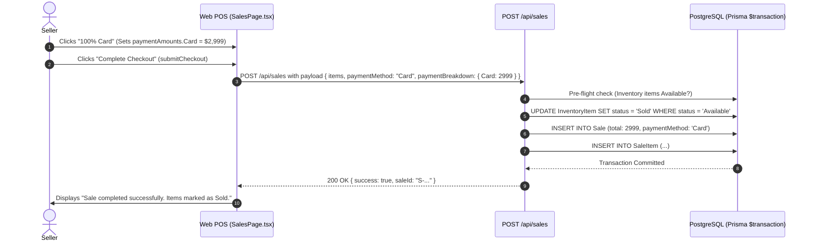

# PAYMENT-06W — WEB POS STRIPE PAYMENT FLOW AUDIT
## Pro Buyer / iReader POS
## Web Checkout — Card Semantics, Stripe Authority & Payment Orchestrator Integration

---

## 1. Executive Summary

**PHASE PAYMENT-06W** is an architectural and code-level audit of the **Web POS Checkout Flow** ([`src/app/sales/page.tsx`](file:///c:/PitayaCode/icellshoppos/src/app/sales/page.tsx) and [`src/app/api/sales/route.ts`](file:///c:/PitayaCode/icellshoppos/src/app/api/sales/route.ts)).

The primary goal of this audit is to evaluate the exact semantics of selecting **`Card`** (or **`100% Card`**) on the Web POS and determine whether it triggers an electronic Stripe payment, controls a Stripe Reader, or executes a payment handoff to an iPhone.

### Key Audit Findings:
1. **`SELECTING CARD ≠ PROOF OF CARD PAYMENT`**: On the Web POS today, entering an amount in the `Card` field or clicking `100% Card` represents an **accounting allocation only**.
2. **Zero Stripe Integration on Web POS**: The Web POS currently does **not** invoke Stripe, does **not** create a `PaymentIntent`, does **not** create a `PosPayment` or `PaymentAttempt`, does **not** call `PaymentOrchestrator`, and does **not** communicate with any physical Stripe Reader.
3. **Sale & Inventory Finalization Gap**: When the seller clicks `Complete Checkout` on the Web POS with `Card` allocated, the backend immediately finalizes the `Sale` and transitions the inventory items from `"Available"` to `"Sold"` without any electronic payment confirmation.
4. **Current Semantic Classification**: Web `Card` currently acts as a **`MANUAL_CARD_RECORD`** (i.e. manual record of an external third-party TPV / terminal transaction), identical to how `Cash` or `Transfer` are recorded manually.

---

## 2. Scope

| Dimension | In Scope | Out of Scope |
| :--- | :--- | :--- |
| **Audited Surfaces** | Web POS UI ([`src/app/sales/page.tsx`](file:///c:/PitayaCode/icellshoppos/src/app/sales/page.tsx)), Web Sales API ([`src/app/api/sales/route.ts`](file:///c:/PitayaCode/icellshoppos/src/app/api/sales/route.ts)) | Modifying checkout code or implementing fixes |
| **Financial Semantics** | Card allocation vs. electronic settlement, inventory finalization | Redesigning Payment Orchestrator |
| **Integration Paths** | Web $\to$ Stripe Reader, Web $\to$ iPhone Handoff, Web $\to$ Payment Orchestrator | Modifying mobile app or Windows iReader |

---

## 3. Authoritative Payment Baseline

The Pro Buyer payment architecture (established in PAYMENT-01 through PAYMENT-05A) mandates that electronic payments follow this strict pipeline:

```
Client Intent
     │
     ▼
PaymentOrchestrator.createPaymentIntent
     │
     ├── PosPayment (status: CREATED)
     ├── PaymentAttempt (status: PROCESSING)
     └── Stripe PaymentIntent (card-present / Tap to Pay)
     │
     ▼
Card Interaction (Stripe Reader or iPhone Tap to Pay)
     │
     ▼
PaymentOrchestrator.verifyPaymentStatus
     │
     ├── Authoritative Stripe API Cloud Check
     ├── PosPayment (status: SUCCEEDED)
     └── PaymentHandoff (status: SUCCEEDED)
     │
     ▼
Sale Finalization & Atomic Inventory Commit
```

---

## 4. Repository Inspection

### Files Analyzed:
- [`src/app/sales/page.tsx`](file:///c:/PitayaCode/icellshoppos/src/app/sales/page.tsx): Main web sales and checkout interface.
- [`src/app/api/sales/route.ts`](file:///c:/PitayaCode/icellshoppos/src/app/api/sales/route.ts): Backend route handling `POST /api/sales`.
- [`src/lib/sales-idempotency.ts`](file:///c:/PitayaCode/icellshoppos/src/lib/sales-idempotency.ts): Sale idempotency lookup.
- [`src/lib/inventory-concurrency.ts`](file:///c:/PitayaCode/icellshoppos/src/lib/inventory-concurrency.ts): Concurrency protection for inventory items.
- [`src/lib/payments/payment-orchestrator.ts`](file:///c:/PitayaCode/icellshoppos/src/lib/payments/payment-orchestrator.ts): Authoritative payment orchestrator.
- [`src/lib/payments/payment-handoff-service.ts`](file:///c:/PitayaCode/icellshoppos/src/lib/payments/payment-handoff-service.ts): Cross-device handoff engine.

---

## 5. Web POS Location & Dependency Map

- **URL Route**: `/sales` (Rendered by `src/app/sales/page.tsx`)
- **API Endpoint**: `POST /api/sales` (Handled by `src/app/api/sales/route.ts`)
- **Key Client State**:
  - `cart: CartItem[]`: Selected inventory devices.
  - `paymentAmounts: Record<PaymentMethodName, string>`: User-entered amounts per payment method (`Cash`, `Transfer`, `Card`, `Trade-in`, `Other`, `Credit`).
  - `customerName`, `customerEmail`, `customerWhatsapp`: Mandatory customer details.

---

## 6. Complete Checkout Trace



---

## 7. Card Trace & Answers to Central Audit Questions

### Code Evidence from `src/app/sales/page.tsx`:
```typescript
// Lines 859-882 in src/app/sales/page.tsx:
const payload = {
  saleId,
  customerName: customerName.trim() || undefined,
  customerEmail: customerEmail.trim().toLowerCase() || undefined,
  customerWhatsapp: fullCustomerWhatsapp,
  sendReceiptEmail,
  paymentMethod: paymentSummaryLabel, // e.g. "Card"
  paymentBreakdown: Object.fromEntries(
    allPaymentMethods
      .map((method) => [method, parseMoney(paymentAmounts[method])] as const)
      .filter(([, amount]) => amount > 0)
  ),
  notes: notes.trim() || undefined,
  discount: totals.discount,
  items: cart.map((item) => ({
    inventoryItemId: item.id,
    imei: item.imei,
    salePrice: Math.round(item.salePrice),
  })),
};
```

### Direct Answers to the 12 Mandatory Questions:

1. **When the seller enters `Card = $2,999`, does the system mean `ALLOCATED` or `PAID`?**
   - **`ALLOCATED`**. It indicates that the seller intends to cover $2,999 with a card, but no financial capture has taken place.
2. **Can Web currently finalize a `CARD` sale without Stripe confirmation?**
   - **`YES`**. `POST /api/sales` immediately creates the `Sale` row without checking Stripe.
3. **Can Web currently mark inventory `SOLD` without Stripe confirmation?**
   - **`YES`**. `POST /api/sales` atomically updates `InventoryItem.status = 'Sold'` without any Stripe verification.
4. **Does Web currently create `PosPayment`?**
   - **`NO`**. The web page does not call `/api/payments/*` or `createPaymentIntent`.
5. **Does Web currently create `PaymentAttempt`?**
   - **`NO`**. No attempt records are created.
6. **Does Web currently create Stripe `PaymentIntent`?**
   - **`NO`**. No Stripe API call is made.
7. **Does Web currently call Payment Orchestrator?**
   - **`NO`**. `PaymentOrchestrator` is not invoked from the web checkout handler.
8. **Does Web currently wait for authoritative Stripe `SUCCEEDED`?**
   - **`NO`**. Checkout completes synchronously upon submitting the web form.
9. **Can Web currently control a physical Stripe Reader?**
   - **`NO (NOT IMPLEMENTED)`**. There is no Stripe Terminal JS SDK integration or server-driven reader execution on the web page.
10. **Can Web currently hand off payment to an iPhone?**
    - **`NO (NOT IMPLEMENTED IN WEB UI)`**. While the backend `/api/payments/handoffs` endpoint exists, the web sales page has no UI or logic to invoke it.
11. **Is current `CARD` semantically `STRIPE_CARD`, `EXTERNAL_CARD_TERMINAL`, `MANUAL_CARD_RECORD`, or `AMBIGUOUS`?**
    - **`MANUAL_CARD_RECORD` / `AMBIGUOUS`**. It behaves as a manual record of an off-platform payment.
12. **What is the minimum architectural change needed so that `SELECTING CARD ≠ PAYMENT SUCCESS`?**
    - The Web POS must initiate a `PosPayment` via `PaymentOrchestrator` (either triggering a Web $\to$ iPhone Handoff or a Server-Driven Stripe Terminal reader), wait for authoritative `SUCCEEDED` status, and only then submit the finalized `posPaymentId` to `POST /api/sales`.

---

## 8. Current vs. Desired Matrix

| Capability | Current Web Behavior | Authoritative? | Uses Payment Orchestrator? | Stripe Verified? | Sale Finalization | Inventory Finalization | Risk | Recommended Future Direction |
| :--- | :--- | :---: | :---: | :---: | :--- | :--- | :---: | :--- |
| **Cash** | Manual amount entry | Yes (Manual) | No | N/A | Immediate | Immediate | Low | Keep manual cash accounting |
| **Transfer** | Manual amount entry | Yes (Manual) | No | N/A | Immediate | Immediate | Low | Keep manual transfer accounting |
| **Card (Web)** | Manual amount entry | **NO** | **NO** | **NO** | Immediate | Immediate | **P1** | Add Stripe Handoff or Stripe Terminal Web |
| **100% Card (Web)** | Shortcut button filling amount | **NO** | **NO** | **NO** | Immediate | Immediate | **P1** | Change label to "Cobrar con Terminal / Handoff" |
| **Split Cash + Card**| Allocates amounts across fields | **NO** | **NO** | **NO** | Immediate | Immediate | **P1** | Require electronic card capture before sale finalization |
| **Stripe Reader** | Not present on Web | N/A | No | No | N/A | N/A | N/A | Enable server-driven S700 Wi-Fi reader on Web |
| **Web $\to$ iPhone Handoff**| Not wired in Web UI | N/A | Backend ready | Backend ready | N/A | N/A | N/A | Add "Enviar a iPhone (Tap to Pay)" modal on Web |
| **External TPV Card**| Recorded as generic "Card" | Yes (Manual) | No | N/A | Immediate | Immediate | Low | Rename to "Tarjeta (Terminal Externa)" for clarity |

---

## 9. Card Authority Matrix

| Event | Can Currently Happen? | Does It Prove Payment? | Can Sale Finalize? | Can Inventory Sell? | Risk Severity |
| :--- | :---: | :---: | :---: | :---: | :---: |
| **Seller selects Card** | Yes | No | No | No | P3 (Cosmetic) |
| **Seller enters Card amount** | Yes | No | No | No | P3 (Cosmetic) |
| **Card allocation reaches total** | Yes | No | No | No | P2 (UX Ambiguity) |
| **Complete Checkout clicked** | **Yes** | **No** | **Yes** | **Yes** | **P1 (Financial Semantics Gap)** |
| **PosPayment created** | No | No | N/A | N/A | Gated on Future Phase |
| **PaymentAttempt created** | No | No | N/A | N/A | Gated on Future Phase |
| **PaymentIntent created** | No | No | N/A | N/A | Gated on Future Phase |
| **Stripe PROCESSING** | No | No | N/A | N/A | Gated on Future Phase |
| **Stripe SUCCEEDED** | No | Yes | N/A | N/A | Gated on Future Phase |
| **Backend verify SUCCEEDED** | No | Yes | N/A | N/A | Gated on Future Phase |
| **Webhook confirms SUCCEEDED** | No | Yes | N/A | N/A | Gated on Future Phase |

---

## 10. Risk Register

- **P1 — Material Financial Semantics Gap**:
  - *Finding*: A seller can mark a $20,000 MXN iPhone sale as "Card" on the Web POS and complete checkout even if the customer's card was never charged or failed on an external terminal.
  - *Impact*: Discrepancy between POS inventory/sales revenue and Stripe bank payouts.
- **P2 — Split Payment State Inconsistency**:
  - *Finding*: The UI displays `Paid: $2,999 | Remaining: $0` as soon as numbers are typed into input fields, creating the false impression that funds have been settled.
- **P2 — Missing Web POS Device Identity**:
  - *Finding*: Web checkout sessions do not pass a `posDeviceId`, preventing granular audit logs of which physical cashier terminal processed the sale.

---

## 11. Safety Audit

- **Windows Architecture**: **UNTOUCHED** (`AppleUsbAdapter`, `libimobiledevice`, `pymobiledevice3`, desktop distribution preserved).
- **Mobile Payment Stack**: **UNTOUCHED** (`StripeTerminalAdapter`, `TapToPayIPhoneAdapter`, `PaymentHandoffService` preserved).
- **Database Safety**: **UNTOUCHED** (Zero migrations, zero schema changes).
- **PAYMENT-06A Status**: **PRESERVED** at `CHECKPOINT_A (APPLE_CAPABILITY_REQUEST)`.

---

## 12. Final Status & Verdict

```
FINAL VERDICT: REQUIRES_REMEDIATION

AUDIT STATUS: COMPLETE
CODE CHANGES: NO (Audit-only phase)

WEB CARD CURRENT SEMANTICS: MANUAL_CARD_RECORD (Ambiguous external terminal entry)
CARD AMOUNT MEANS: ALLOCATED (Not electronically settled)
WEB CARD USES POSPAYMENT: NO
WEB CARD USES PAYMENTATTEMPT: NO
WEB CARD CREATES STRIPE PAYMENTINTENT: NO
WEB CARD USES PAYMENT ORCHESTRATOR: NO
WEB CARD WAITS FOR STRIPE SUCCEEDED: NO
WEB CARD CAN FINALIZE WITHOUT STRIPE: YES
INVENTORY CAN BECOME SOLD WITHOUT STRIPE: YES
WEB STRIPE READER SUPPORT: NO (Not implemented in Web UI)
WEB → IPHONE HANDOFF: PARTIAL (Backend endpoints exist; Web UI not connected)

SPLIT PAYMENT SETTLEMENT MODEL: ALLOCATION_ONLY
PAYMENT-05A INTEGRITY: PRESERVED (Backend models safe; Web bypasses electronic flow)
MULTI-TENANT SECURITY: PASS (Organization scoping intact)
WEBHOOK REUSABILITY: REUSABLE (StripeWebhookEvent channel-agnostic)
REFUND TRACEABILITY: LIMITED (Web card sales lack Stripe PaymentIntent ID)
RECONCILIATION: MANUAL ONLY (Cannot auto-reconcile against Stripe payouts)

AUTOMATED TESTS: 72/72 PASS
TYPESCRIPT: 0 ERRORS
WINDOWS STACK: UNTOUCHED
MOBILE PAYMENT STACK: UNTOUCHED
DATABASE: UNTOUCHED

P0 FINDINGS: 0
P1 FINDINGS: 1 (Web Card finalizes Sale and Inventory without electronic confirmation)
P2 FINDINGS: 2 (UI "Paid" label ambiguity, lack of Web POSDevice ID)

MINIMUM REQUIRED REMEDIATION:
1. In Web POS UI: Connect "Card" payment to the backend Handoff system (allow web cashier to click "Cobrar con iPhone" to delegate Tap to Pay).
2. For manual card terminals: Explicitly label manual entries as "Tarjeta (Terminal Externa / Manual)" so sellers understand it is an accounting record.
3. For integrated Stripe payments: Require `posPaymentId` / `paymentIntentId` with status `SUCCEEDED` before permitting `Complete Checkout`.

RECOMMENDED NEXT PHASE: PAYMENT-06W.1 (Web POS Stripe Handoff & Terminal Integration)
```
